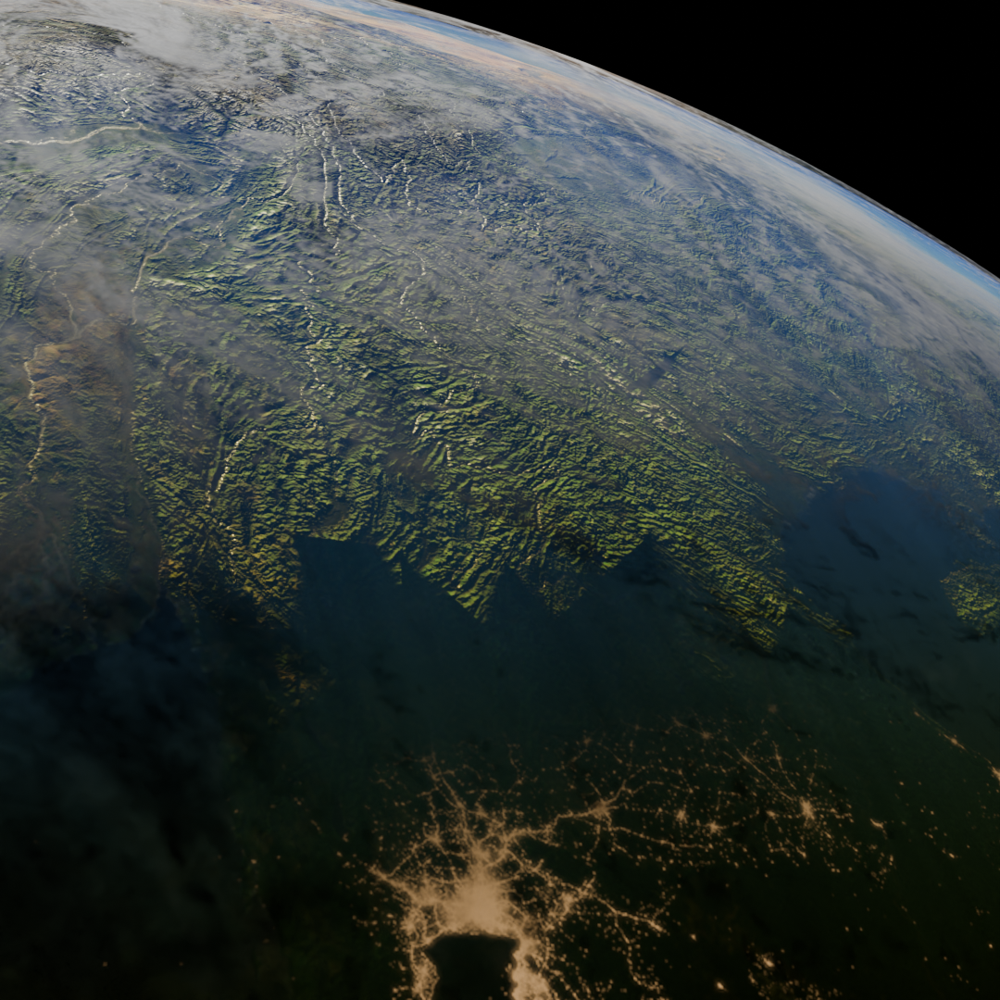
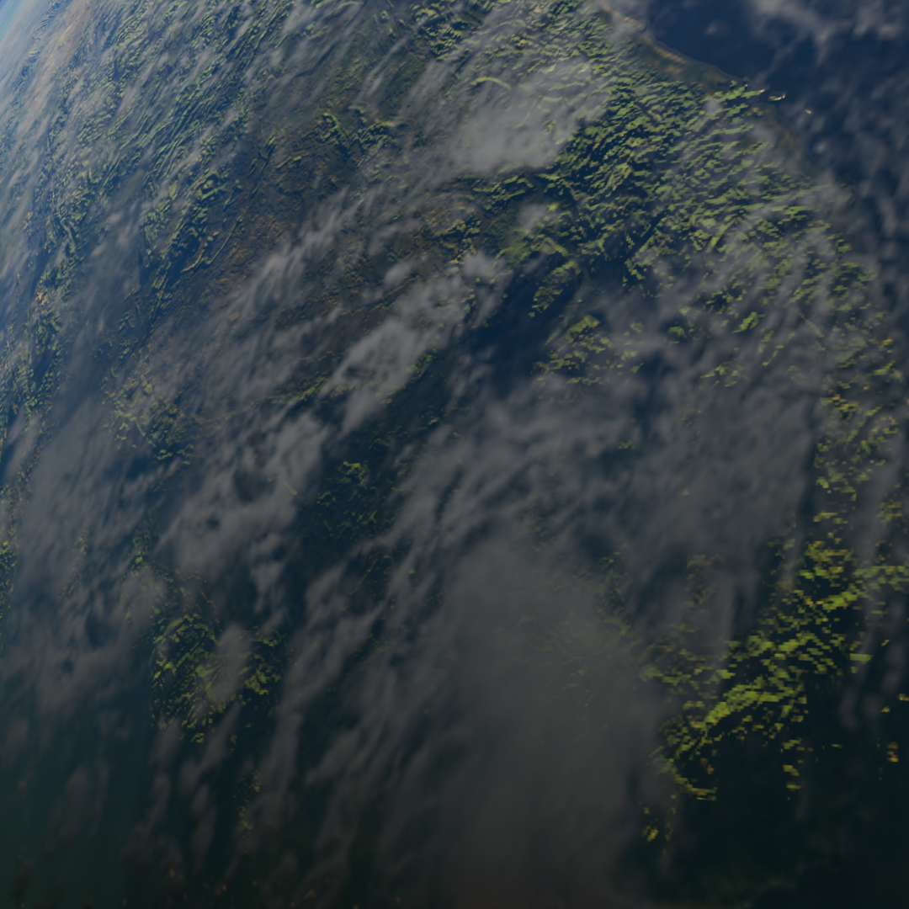
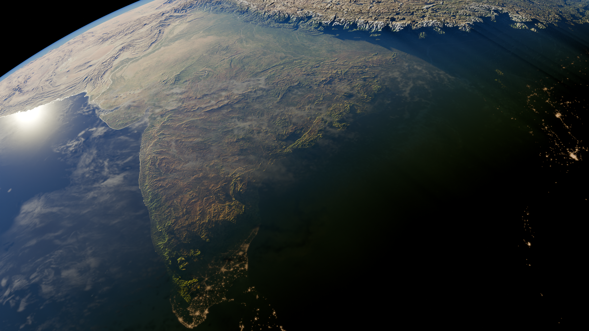
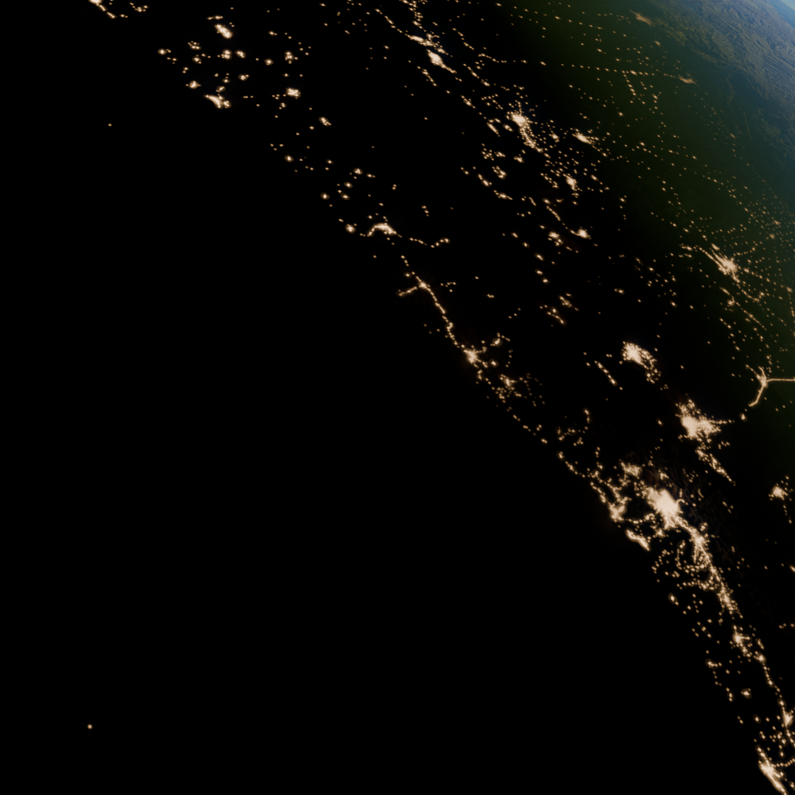

# 🎨 3D Blender Archive

A curated collection of my 3D modeling and rendering work, focused on high-fidelity procedural texturing, atmospheric lighting, and seamless animation loops.

---

## 🚀 Latest Spotlight: Earth & Mothership
**Seamless 60fps cinematic loop** rendered with **Cycles Engine**. This project explores orbital mechanics, procedural clouds, and particle-based engine glows.

  <video src="earth-spaceship.mp4" width="100%" controls autoplay loop muted></video>

---

## 📂 Featured Projects: Atmospheric Earth
High-resolution planet rendering with **21K Topography Maps**, **10K Color Data**, and realistic atmospheric scattering.

  

| RENDER_SHOT_01 | RENDER_SHOT_02 |
| :---: | :---: |
|  |  |

| RENDER_SHOT_03 | RENDER_SHOT_04 |
| :---: | :---: |
|  |  |

### 🛠️ Technical Details
- **Engine:** Blender 4.0+ Cycles
- **Assets:** Included `.blend` source files (check `/Earth` folder)
- **Textures:** High-resolution map mix (21K Topography, 8K Clouds)
